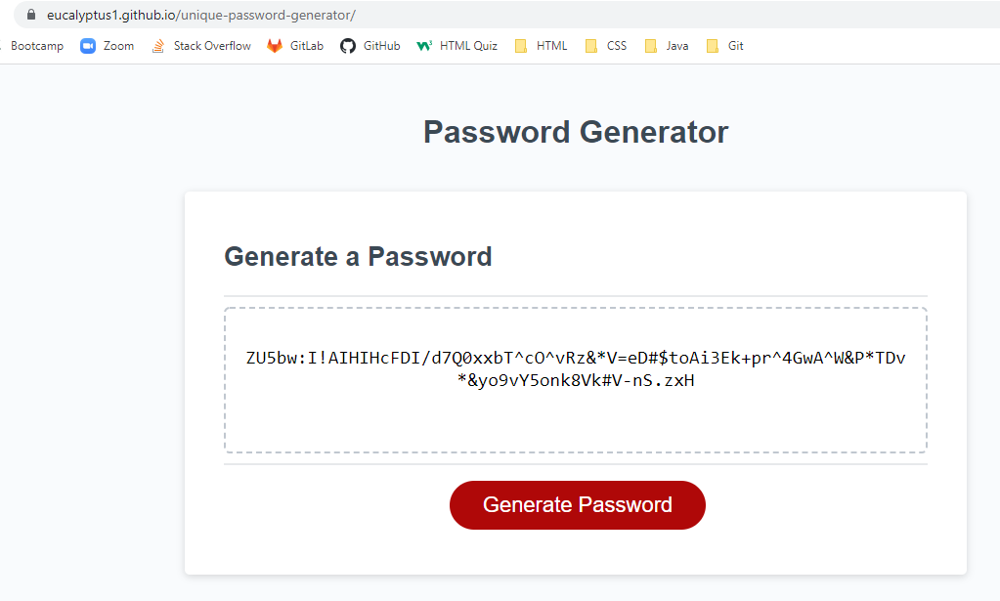

# Password Generator

## Purpose
To randomly generate a password based on the user's choice of Uppercase, Lowercase, Numeric and Special characters. Upon making all of their specific choices, the random password will appear for them to copy.

## Built with
*HTML

*CSS

*Javascript

## Website
https://eucalyptus1.github.io/unique-password-generator/

## Contribution
Made by James

